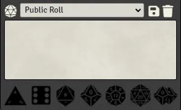

# FoundryVTT Fast Rolls

This module offers the ability to roll dice with as little as one click and more.

A series of dice buttons have been added bellow the chat, they can be used in different fashions.

-   a regular click on a die will make a roll and display it in the chat right away.

-   if the `ctrl` key is held, the roll will be blind instead.

-   if the `shift` key is held and nothing is present in the chat box, a new roll sequence will be started in the form of `/r 1dx`.

-   if the `shift` key is held and a roll sequence exists (from a previous `shift + click` or manually typed), more will be added to it, updating existing dice if needed.

-   if the `shift` key is being held while any text is present in the chat box, a new inline sequence will be added at the end of the text in the form of `[[1dx]]`

-   if the `shift` key is being held while an inline sequence is present at the end of the chat box text, more will be added to it, updating existing dice if needed.

NOTE: Only basic dice are handled by the module `d4, d6, d8, d10, d12, d20 and d100`

# CHANGELOG

You can see the changelog [HERE](./CHANGELOG.md)
